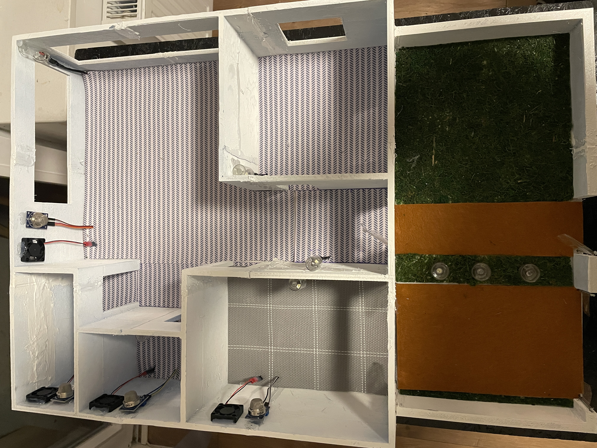

# SmartHome - Physical Smart Home Model

This repository contains a physical smart home model built as an engineering project. The system combines an Arduino Mega 2560, a Raspberry Pi 3, a Flask web application, servos, LED lighting, MQ-9 gas sensors and ventilation fans.

The project demonstrates selected smart home functions on a working scale model: remote control of gates and doors, LED lighting control, gas detection and automatic ventilation after a sensor threshold is exceeded.

<p align="center">
  <a href="media/images/README.md"></a>
</p>

[View the project gallery](media/images/README.md) for photos of the completed model, electronics, 3D renders, circuit schematics and the web dashboard.

## Features

- Remote control through a web-based dashboard.
- Opening and closing of 6 physical elements using servos.
- Control of 10 LED lighting points.
- Gas detection using 4 MQ-9 sensors.
- Automatic control of 4 ventilation fans based on gas sensor readings.
- Serial communication between Raspberry Pi and Arduino over USB.

## Architecture

```text
Phone / laptop
      |
      | HTTP
      v
Flask web dashboard on Raspberry Pi
      |
      | USB serial: SERVO / LED
      v
Arduino Mega 2560
      |
      +-- servos
      +-- LED lighting
      +-- MQ-9 gas sensors
      +-- ventilation fans
```

## Repository Structure

```text
.
|-- app.py                         # Flask backend and serial communication
|-- templates/index.html           # Web control panel
|-- firmware/smarthome/            # Arduino Mega 2560 firmware
|-- hardware/kicad/SmartHome/      # KiCad schematics
|-- hardware/models/               # STL model files
`-- media/                         # Demo videos and project images
    `-- images/                    # Photo gallery, 3D renders and schematics
```

## Running the Application

1. Upload `firmware/smarthome/smarthome.ino` to the Arduino Mega 2560 using Arduino IDE.
2. Connect the Arduino to a Raspberry Pi or computer over USB.
3. Create a Python virtual environment and install the dependencies:

```powershell
python -m venv .venv
.\.venv\Scripts\Activate.ps1
pip install -r requirements.txt
```

4. Set the serial port if it is different from the default `/dev/ttyACM0`:

```powershell
$env:SERIAL_PORT = "COM3"
```

5. Start the Flask application:

```powershell
python app.py
```

The dashboard will be available at `http://localhost:5000`. On a Raspberry Pi connected to the same network, use the device IP address, for example `http://192.168.1.20:5000`.

## Communication Protocol

The Flask application sends simple text commands to the Arduino over serial communication. Each command ends with a newline character.

```text
SERVO <id> <position>
LED <id> <state>
```

Examples:

```text
SERVO 1 110
LED 3 1
LED 3 0
```

## Project Materials

- [Project gallery](media/images/README.md): 17 photos, renders and screenshots documenting the model and its hardware.
- KiCad schematics are available in `hardware/kicad/SmartHome`.
- The STL model is available in `hardware/models/STL_Smarthome.stl`.
- `media/czujniki-gazu.mp4` demonstrates gas sensor detection.
- `media/zdalne-sterowanie.mp4` demonstrates remote control of the model and is stored using Git LFS.
